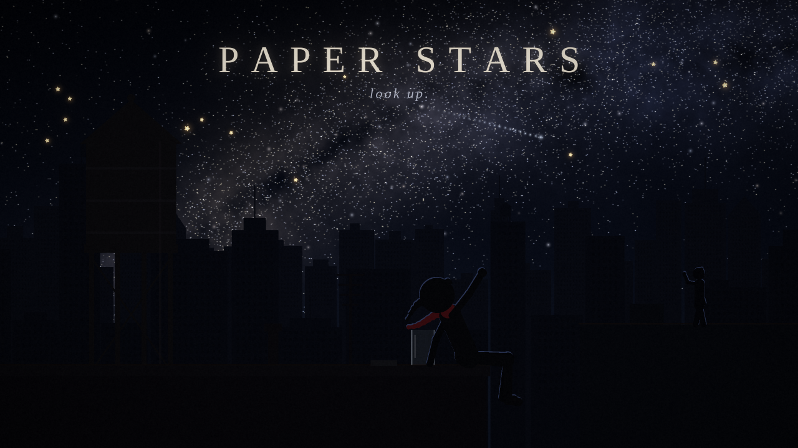

# PAPER STARS

*An original animated short film · 2 minutes 6 seconds · no dialogue*



> In a city so bright that no one has seen a star in years, a girl on a rooftop
> folds her own out of paper, and slowly gets a whole city to turn off its
> lights and look up.

**▶ Watch it: [`output/paper_stars.mp4`](output/paper_stars.mp4)** (1280×720, 24 fps, stereo)

Every frame and every sound in the film is generated by the Python code in
this repository. It uses no stock footage, samples, image assets, or AI image
or video models. The skyline, the sky, Mira, the score, and the
light-switch clicks are all math.

## The film

| | |
|---|---|
| **Logline** | A girl who has never seen a real star folds paper ones, and a city learns to look up. |
| **Story** | [`story/treatment.md`](story/treatment.md): characters, theme, and the story in prose |
| **Screenplay** | [`story/screenplay.fountain`](story/screenplay.fountain) in [Fountain](https://fountain.io) format, which opens in Highland, Slugline, Beat, or any text editor |
| **Shot list** | [`story/shot_list.md`](story/shot_list.md): every shot with timing, camera, picture and sound |

### Beats

1. **No Stars.** A skyline of 18,000+ windows under a flat orange haze. The only blinking light is a plane.
2. **The Rooftop.** Mira searches the sky and points, but it's only the plane.
3. **The Fold.** A strip of paper gets knotted, wound, pinched, and puffed into a star that begins to glow.
4. **The Release.** It floats up to be the only star in the sky. Then she opens the jar.
5. **The Drift.** A river of paper stars crosses the city, and people come to their windows.
6. **Lights Out.** *Click.* A ripple of darkness spreads across the whole city, except for one stubborn window.
7. **The Reveal.** Silence, and then thousands of stars and the Milky Way.
8. **Together.** A wave from the next rooftop, and a shooting star.

## Making it

```bash
pip install -r requirements.txt
python make_film.py              # full film + soundtrack -> output/paper_stars.mp4 (~6 min on 4 cores)
python make_film.py --stills     # key frames -> output/stills/
python make_film.py --preview 72 102   # render just a time range (no audio)
python make_film.py --audio-only # soundtrack -> output/soundtrack.wav
python make_film.py --poster     # -> output/poster.png
```

`imageio-ffmpeg` ships its own ffmpeg binary, so nothing else needs to be installed.
Rendering is deterministic: the same seed produces the same film.

### How it works

| Module | What it does |
|---|---|
| [`paperstars/config.py`](paperstars/config.py) | Master timeline: shot boundaries, dissolves, and every story beat shared by picture and sound |
| [`paperstars/city.py`](paperstars/city.py) | Procedural skyline in three parallax layers. Each window has its own ID, colour, TV flicker, occupant silhouette, and **switch-off time**, which is how the lights-out ripple spreads outward from the centre of frame |
| [`paperstars/sky.py`](paperstars/sky.py) | Light-polluted haze, a 60,000-star field, a fractal-noise Milky Way with dust lanes, twinkling, and the blinking airplane |
| [`paperstars/characters.py`](paperstars/characters.py) | Mira, a posable 2D silhouette rig (torso, head, ponytail, wind-blown scarf, two-segment limbs) with a pose library (`search`, `point`, `cup`, `raise`, `lean`, `wave`…), plus the neighbor, water tower, and jar |
| [`paperstars/shots.py`](paperstars/shots.py) | Each shot is a function `T -> frame`. The fold insert morphs polygons from strip to knot to pentagon to puffed star |
| [`paperstars/cameras.py`](paperstars/cameras.py) | Pans and tilts per shot, with sub-pixel parallax |
| [`paperstars/render.py`](paperstars/render.py) | Cross-dissolves, bloom, grade, vignette, film grain, and parallel rendering piped into ffmpeg |
| [`paperstars/audio.py`](paperstars/audio.py) | The score and sound design: music box, pads, Karplus-Strong plucked strings, choir swell, and convolution reverb. The ambience follows how much of the city is lit, and every visible window gets its own click, panned to where it is on screen |

### The score

The whole film grows out of one five-note motif, **A-D-E-F♯-A**, which rises the
way you'd look up. It plays alone under the title and deflates when the blinking
light turns out to be a plane. A ticking ostinato carries it while Mira folds,
and it lifts the first star into the sky. Over the city it becomes a full
melody on plucked strings, then accelerates with the lights-out ripple and
**stops dead** for the stubborn window. After the silence it comes back slow
and wide with a choir as the Milky Way appears, and it resolves on D at the end.

## Changing it

This is a starting point, not a locked cut. Some ideas:

- **Retime a beat** by editing `paperstars/config.py`. Picture and sound both read from it.
- **Restyle the city** with `LAYER_SPECS` in `city.py` (building sizes, window density, colours).
- **New pose or gesture:** add an entry to `POSES` in `characters.py` and key it in a shot.
- **Rewrite the music:** `compose()` in `audio.py` is a readable score (`phrase(music, 44.4, MOTIF, 0.45, ...)`).
- **Higher resolution:** change `W, H` in `config.py`. Shot layouts assume 16:9.

## Also in this repo: the explainer pipeline

[`explainer/`](explainer/) is a separate pipeline for cinematic, subtitle-driven
science explainers (Remotion + Python): an episode script anchored to the
music's break and drop, beat-snapped subtitles, music-reactive lighting, QA
contact sheets, and a −14 LUFS master. See [`explainer/README.md`](explainer/README.md).
